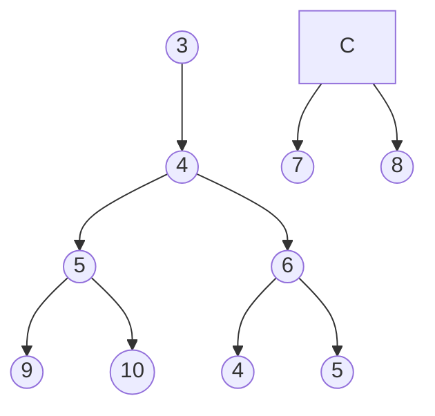
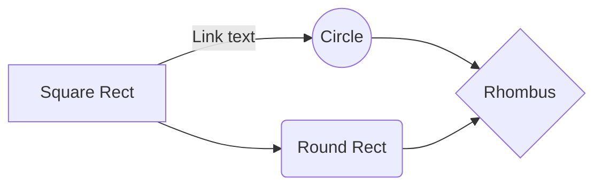

### Universidad Nacional de San Agustín   Maestría en Ciencia de la Computación    Algoritmos y Estructura de Datos

# Practica 01

| DOCENTE | CARRERA | CURSO |
| :-: | :-: | :-: |
| Vicente Machaca Arceda | Maestría en Ciencia de la Computación | Algoritmos y Estructura de Datos |
 

| PRÁCTICA | TEMA | DURACIÓN |
| :-: | :-: | :-: |
| 01 | Algoritmos de ordenación | 3 horas

## 1. Integrantes
- Asmat Fuentes, Franz Rogger
- Esthela Espinoza, Fausto Danilo
- Ojeda Mamani, Abel Eberth
- Paredes Rodriguez, Raybert

## 2. Ejercicios

### 2.1. QuickSort

QuickSort

### 2.2. MergeSort

MergeSort

### 2.3. BucketSort

BucketSort

### 2.4. HeapSort

    ""El tiempo de ejecución de heapsort es _O(n lg n)_. Al igual que la ordenación por inserción, pero a diferencia de la ordenación por fusión, la ordenación por montón ordena en el lugar: solo se almacena una cantidad constante de elementos de matriz fuera de la matriz de entrada en cualquier momento. Por lo tanto, heapsort combina los mejores atributos de estos dos algoritmos de clasificación.
        
    Heapsort también presenta otra técnica de diseño de algoritmos: usar una estructura de datos, en este caso una que llamamos _**montón** (heap)_, para administrar la información. La estructura de datos del montón no solo es útil para heapsort, sino que también crea una cola de prioridad eficiente"". (cormen2022)

    El funcionamiento del algoritmo es generar un árbol binario para el array, se comparan los elementos padre de cada nodo (que contenga hijos) y se verifica que ambos hijos sean menores que el nodo padre, de no cumplirse esta regla se procede a realizar un intercambio del valor mayor con el padre. Se procede de forma consecutiva hasta tener el elemento de mayor valor hasta la cima, una vez obtenido se intercambia con el ultimo elemento y se vuelve a repetir el proceso hasta que el array se encuentre ordenado.

    **Ejemplo**
    Teniendo el siguiente array:

| 3 | 4 | 9 | 5 | 2 | 0 | 1 | 6 | 8 | 7 |
|---|---|---|---|---|---|---|---|---|---|
| 0 | 1 | 2 | 3 | 4 | 5 | 6 | 7 | 8 | 9 |

        En base a este array se genera el siguiente árbol

        $$
        \begin{tikzpicture}
            [level distance=10mm,
            every node/.style={circle,draw,inner sep=2mm},
            level 1/.style={sibling distance=25mm},
            level 2/.style={sibling distance=15mm},
            level 3/.style={sibling distance=15mm}]
            \node {3}
                child {node {7}
                child {node {2}
                    child {node {1}}
                    child {node {8}}
                }
                child {node {4}}
                }
                child {node {5}
                child {node {6}}
                child {node {9}}
                };
        \end{tikzpicture}
        $$

## 3. TeX

You can render LaTeX mathematical expressions using [KaTeX](https://khan.github.io/KaTeX/):

The *Gamma function* satisfying $\Gamma(n) = (n-1)!\quad\forall n\in\mathbb N$ is via the Euler integral

$$
\Gamma(z) = \int_0^\infty t^{z-1}e^{-t}dt\,.
$$

> You can find more information about **LaTeX** mathematical expressions [here](http://meta.math.stackexchange.com/questions/5020/mathjax-basic-tutorial-and-quick-reference).

And this will produce a flow chart:

