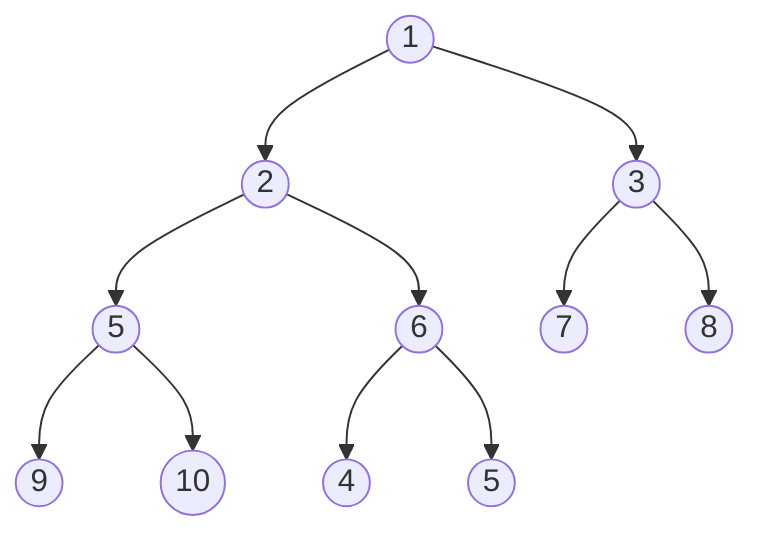
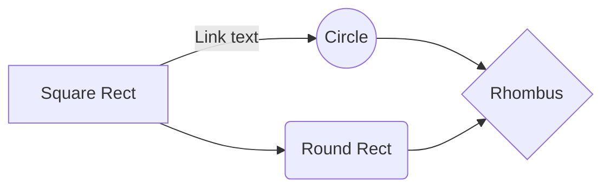

### Universidad Nacional de San Agustín   Maestría en Ciencia de la Computación    Algoritmos y Estructura de Datos

# Practica 01

| DOCENTE | CARRERA | CURSO |
| :-: | :-: | :-: |
| Vicente Machaca Arceda | Maestría en Ciencia de la Computación | Algoritmos y Estructura de Datos |
 

| PRÁCTICA | TEMA | DURACIÓN |
| :-: | :-: | :-: |
| 01 | Algoritmos de ordenación | 3 horas

## 1. Integrantes
- Asmat Fuentes, Franz Rogger
- Esthela Espinoza, Fausto Danilo
- Ojeda Mamani, Abel Eberth
- Paredes Rodriguez, Raybert

## 2. Ejercicios

### 2.1. QuickSort

QuickSort

### 2.2. MergeSort

MergeSort

### 2.3. BucketSort

BucketSort

### 2.4. HeapSort

HeapSort

| 0 | 1 | 2 | 3 | 4 | 5 | 6 | 7 | 8 | 9 | 10 | 11 |
|---|---|---|---|---|---|---|---|---|---|----|----|
| 3 | 4 | 5 | 3 | 2 | 2 | 4 | 6 | 9 | 1 | 4  | 2  |

## 3. TeX

You can render LaTeX mathematical expressions using [KaTeX](https://khan.github.io/KaTeX/):

The *Gamma function* satisfying $\Gamma(n) = (n-1)!\quad\forall n\in\mathbb N$ is via the Euler integral

$$
\Gamma(z) = \int_0^\infty t^{z-1}e^{-t}dt\,.
$$

> You can find more information about **LaTeX** mathematical expressions [here](http://meta.math.stackexchange.com/questions/5020/mathjax-basic-tutorial-and-quick-reference).

And this will produce a flow chart:

